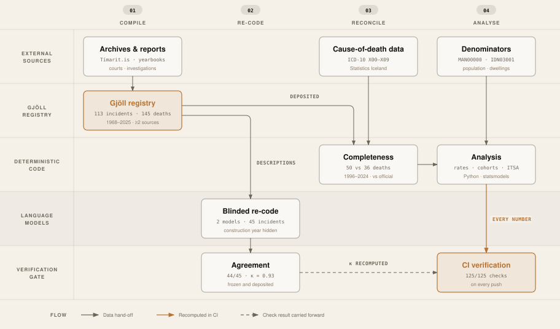

# Fatal Fire Incidents in Iceland, 1968–2025

**A National Registry Study of Building Construction Period and Fire Mortality**

[](https://github.com/Magnussmari/gjoll-fire-technology/actions/workflows/verify.yml)
[](LICENSE)
[](https://doi.org/10.34881/I5WGJU)
[](requirements.txt)

Magnús Smári Smárason & Thomas Barry · University of Akureyri (Háskólinn á Akureyri)
Target journal: **Fire Technology** (Springer Nature)

---

This repository is the complete, reproducible companion to the study. It holds the
**Gjöll registry** (every fatal fire incident in Iceland over 58 years, compiled
incident-by-incident from newspaper archives, institutional yearbooks, and official
reports, each record source-referenced), the analysis code, and a verification script
that **recomputes every number in the manuscript from the deposited data**.

- **113** fatal incidents · **145** deaths · **1968–2025** (58 years)
- Registry deposited at DATICE, DOI [10.34881/I5WGJU](https://doi.org/10.34881/I5WGJU) · browseable at [gjoll.is](https://www.gjoll.is)
- Every reported statistic is machine-verified in CI (**122/122 checks**, see [`.github/workflows/verify.yml`](.github/workflows/verify.yml))

## The pipeline



Drawn from [`pipeline/pipeline.json`](pipeline/pipeline.json), the single record that
www.gjoll.is also renders. `make pipeline` redraws it; CI runs
`build_pipeline_diagram.py --check`, which recomputes every number in the record from
`data/` and fails if the record or the drawing has drifted. The language-model lane holds
one node: no model produced a reported value, only a blinded check of the classification.

The official 1968–2018 fire-death series (HMS working-group report, 2020) is published only as a
bar chart. `scripts/digitize_hms2020_chart.py` reads it off the pixel grid (every reading must land
within 0.1 of a whole number; the largest is 0.03) into
`data/hms2020_official_fire_deaths_1968_2018.csv`, and `scripts/reconcile_hms2020.py` sets it beside
the registry year by year in `data/hms_reconciliation_1968_2018.csv`.

## Reproduce in one command

```bash
make setup && make verify
```

`make verify` runs [`scripts/verify_statistics.py`](scripts/verify_statistics.py), which
recomputes all 122 reported figures (rates, exact-Poisson bounds, the coherent joint
denominator sensitivity, the interrupted time series, seasonality, and the cohort
comparison) directly from the CSVs in `data/` and asserts each against the manuscript.
`make help` lists every target; `make reproduce` regenerates the tables and figures.

Without `make`:

```bash
pip install -r requirements.txt
python scripts/verify_statistics.py        # the gate: 122/122
python scripts/reproduce_tables_figures.py # regenerate tables + figures
```

## What is where

```
manuscript/     current manuscript (Quarto): Smarason_2026_BriefCommunication.qmd
                + Smarason_2026_ANONYMIZED.qmd (double-blind) + supplementary[_ANON].qmd + references.bib
data/           deposited registry CSVs + population (MAN00000) + dwelling completions (IDN03001)
scripts/        analysis + verification
                  verify_statistics.py        the living audit (recomputes every number)
                  verify_references.py         checks every reference DOI resolves
                  reproduce_tables_figures.py  regenerates tables + figures
                  denominator_from_completions.py · advanced_analyses.py · revision_analyses.py
figures/        publication figures (PNG)
output/         generated tables/figures (regenerable; gitignored)
Final-version/  STROBE/RECORD reporting checklist and bibliography
```

## Key finding

Across 58 years, the fatal-fire rate in buildings of recorded construction year 1999 or
later (the effective year of *Byggingarreglugerð* nr. 441/1998) is several-fold lower than
in pre-1998 dwellings. Reported as exact Poisson rate ratios, every 95% confidence interval
excludes 1 at the modeled denominator under every convention for classifying a fatal fire in
a building. The result is framed as a **construction-period cohort description, not proof of a
regulatory effect**: construction period bundles building age, materials, occupancy, and
concurrent secular change, and the interrupted time series shows a pre-existing decline with no
discrete step at 1999.

## Cite

If you use the registry or this package, please cite the deposited dataset (see
[`CITATION.cff`](CITATION.cff); GitHub's "Cite this repository" button renders it):

> Smárason, M. S., & Barry, T. (2026). *Gjöll: A National Registry of Fatal Fire Incidents
> in Iceland, 1968–2025* [Data set]. DATICE (GAGNÍS), University of Iceland.
> https://doi.org/10.34881/I5WGJU

## License

Code: [MIT](LICENSE). Registry data in `data/`: deposited at DATICE under its own terms;
attribution requested for reuse (see the data note in [`LICENSE`](LICENSE)).
