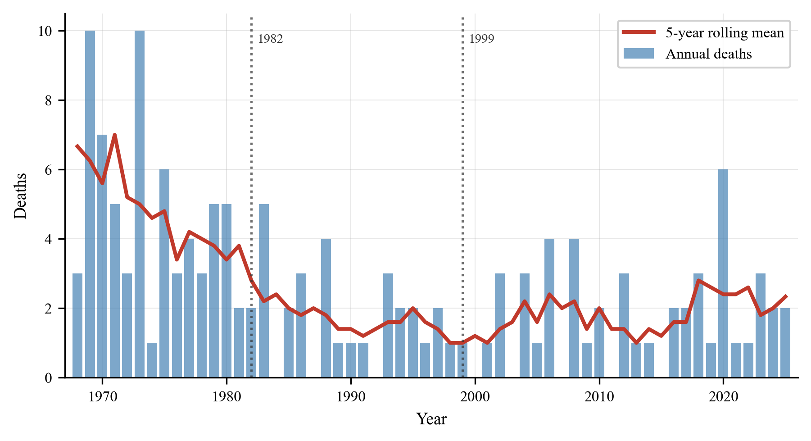
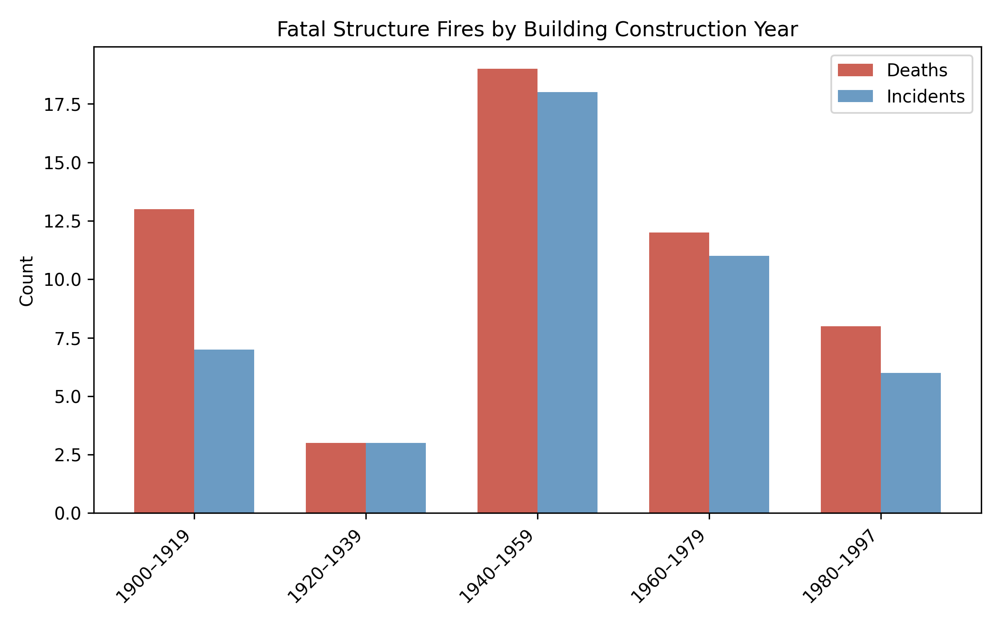
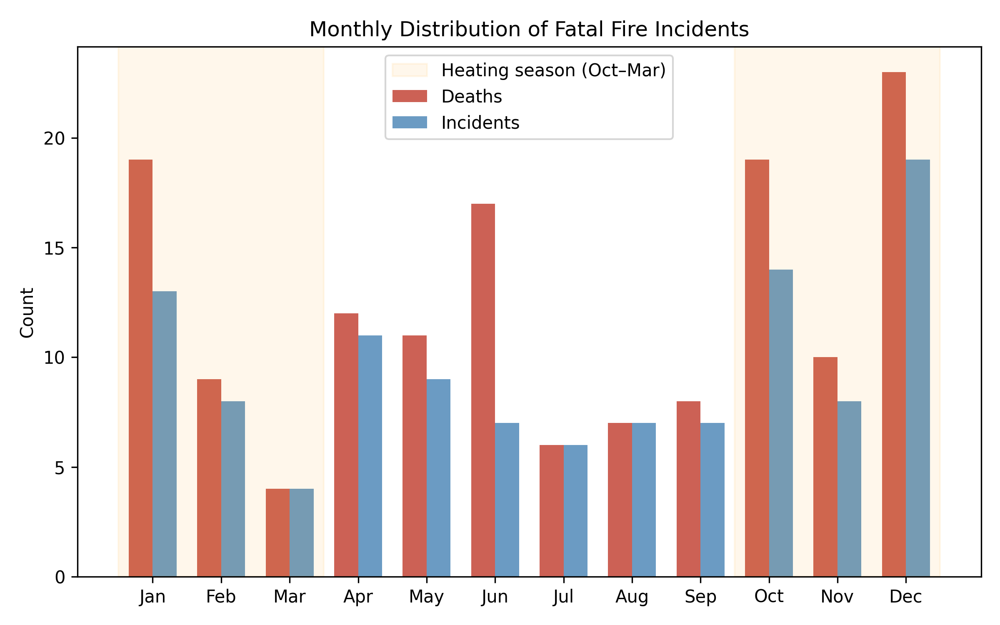

# Introduction {#sec-introduction}

Effective fire safety regulation depends upon reliable, long-term data to evaluate outcomes and direct prevention resources. However, national fire fatality statistics are often disseminated as aggregate counts without incident-level traceability, limiting their value for trend analysis and policy evaluation [@EFSA2018; @Holborn2003]. This is particularly true for small nations where annual counts are low and year-to-year variation is large. More broadly, evaluating whether a regulatory framework achieves its intended goals—what the governance literature terms institutional effectiveness [@Young2011]—requires not only statistical trend data but also contextual understanding of how regulations translate into on-the-ground outcomes.

Iceland provides a uniquely informative case for studying the long-term effectiveness of fire safety regulation. Its small population (approximately 200,000 in 1968, growing to 388,000 in 2025) enables national-scale compilation of every fatal fire incident over nearly six decades—a level of completeness rarely achievable in larger jurisdictions. Iceland's centralized regulatory framework applies uniformly nationwide, providing clear before-and-after conditions for evaluating regulatory milestones. Moreover, Iceland's building stock is among the youngest in Europe, with a mean construction year of approximately 1992 [@HMS2024buildingAge], meaning that a substantial and growing proportion of the housing stock already meets modern fire safety standards. This combination of complete incident data, identifiable regulatory interventions, and a young building stock creates conditions under which the effectiveness of fire safety regulation can be examined with unusual clarity. Iceland's fire safety framework has evolved through successive acts and regulations: the Fire Prevention Act (Lög nr. 55/1969) established a national fire authority (Brunamálastofnun); subsequent fire prevention acts (Lög nr. 74/1982; Lög nr. 41/1992) expanded regulatory duties; a revised building regulation (Byggingarreglugerð nr. 441/1998) introduced mandatory smoke detectors and portable extinguishers in all new dwellings; and the current Fire Prevention Act (Lög nr. 75/2000) consolidated the legislative framework [@Iceland1969; @Iceland1982; @Iceland1992; @Iceland1998; @Iceland2000]. The scale of the original challenge is illustrated by the 1968 fire prevention bill (Þingskjal 121), which noted that insurance payouts for fire damages during 1960–1967 equalled the cost of a major hydroelectric project, and that per-capita fire losses were two to three times higher than in the other Nordic countries [@Iceland1969; @Smarason2025practitioner]. In the Nordic context, published fire-death statistics indicate that Iceland has, in most reporting years, recorded the lowest per-capita fire mortality among the Nordic countries, though year-to-year variation remains substantial and some figures are noted as pending revision [@MSB2023].

The Gjöll^[In Norse mythology, Gjöll is the river that separates the world of the living from the world of the dead (Hel), crossed via the bridge Gjallarbrú (*Prose Edda*, Gylfaginning). The name is chosen for this registry to reflect its focus on fatal fire incidents.] Database on Fire and Fire Prevention [URL removed for review] was created to address the lack of a national incident-level dataset for fatal fires in Iceland. Covering 1968–2025, Gjöll was compiled through systematic review of newspaper archives (notably timarit.is), institutional yearbooks, and official government reports, with source references for each record [@Smarason2025data; @Timarit]. All 113 fatal fire incidents were identified and verified against at least two independent sources. The registry and its preliminary descriptive results have also been disseminated to practitioner audiences (fire services and emergency medical services) in Iceland [@Smarason2025practitioner].

This study uses the Gjöll registry to describe (i) long-term trends in fatal fire incidents and deaths, (ii) seasonal patterns, and (iii) the distribution of fatal structure-fire incidents by building construction year, with particular attention to the role of building age and regulatory change in fire fatality outcomes. In doing so, it contributes to the broader question of whether Iceland's fire safety regulatory framework has been effective not merely on paper but in measurable outcomes.

# Data and Methods {#sec-methods}

## Data Source

We used two exported tables (CSV) from the Gjöll incident registry: fatal structure fires (*n* = 93 incidents) and other fatal fire-related incidents (*n* = 20 incidents). The export metadata indicates a 2025-09-15 export date [@Smarason2025data]. The unit of analysis is the fatal incident. All fatal fire incidents in the export for 1968–2025 were included; no sampling was performed.

## Variables

Each incident record includes incident date, calendar year, and number of deaths. Structure-fire records additionally include municipality, address/postal code (when available), and building construction year (missing for 48 of 93 structure-fire incidents). Other fatal fire-related incidents include a coarse subtype (e.g., ship fire or vehicle fire).

## Incident Classification

Incidents were classified into two categories: fatal fires in structures (93 incidents, 116 deaths) and other fire-related deaths involving ships, vehicles, and other non-building settings (20 incidents, 29 deaths). The classification criterion, applied uniformly regardless of building age or construction year, was whether the fire originated in or spread through the building structure such that structural fire safety features (egress, compartmentation, detection, suppression) were relevant to the fatality outcome.

Borderline cases required judgment. For example, a 2014 nursing home fire (building constructed 2001) where an elderly resident died was classified as "other" because the death resulted from a localized ignition (bedding) in a building whose fire safety systems functioned as designed—the fatality mechanism did not involve structural fire spread. Conversely, a criminal arson incident at Bræðraborgarstígur, Reykjavík, in 2020 (original construction year 1906, 3 deaths) was classified as a structure fire because fire spread through the building and structural safety features (egress routes, compartmentation) were material to the outcome [@HMS2020]. The same classification would have applied regardless of the building's construction year.

## Analysis {#sec-analysis}

Descriptive summaries were computed for incident severity (deaths per incident), decade totals (incidents and deaths), seasonal patterns by calendar month and by heating season (October–March) versus non-heating season (April–September), and construction-year bands for fatal structure fires.

For population-adjusted rates, annual population on 1 January was obtained from Statistics Iceland (PX table MAN00000.px, Eining = 0) for 1968–2025 [@StatisticsIceland2025]. For each period bin, "mean population" is the mean of annual 1 January population counts across years in that bin. Crude annualized deaths per million population are reported by decade for Nordic comparability. To illustrate rare-event uncertainty for short observation windows, exact Poisson 95% confidence intervals are reported for selected rates.

**Person-years exposure approximation.** To address the absence of a census-based housing-stock denominator stratified by construction period, we approximated person-years of exposure in pre-1998 versus post-1998 dwellings for the 1999–2025 period. Annual dwelling completions were modeled using stepped rates consistent with Iceland's construction history and the documented mean building-stock construction year of approximately 1992 [@HMS2024buildingAge; @HMS2025completions]: 500/year prior to 1940, 2,000/year 1940–1979, 2,500/year 1980–1997, 3,000/year 1998–2009, and 3,500/year 2010–2025. Population was allocated to building-age strata proportionally to the modeled stock fraction. The constant completion-rate assumptions do not capture the substantial volatility in Iceland's construction industry. Statistics Iceland data (table IDN03001) show actual annual completions ranging from a peak of approximately 3,350 in 2007 to a trough of approximately 565 in 2011—a six-fold variation that the stepped model cannot represent. Moreover, the stepped rates for 1998–2009 (3,000/year) and 2010–2025 (3,500/year) overestimate actual mean completions (approximately 1,900/year and 2,200/year, respectively), meaning the modeled post-1998 person-years denominator is likely overstated. This overstatement makes the analysis conservative: the true upper confidence bound for the post-1998 fatality rate would be higher than reported, though the qualitative conclusion (zero deaths, rate well below pre-1998) is unaffected. A sensitivity analysis halving or doubling the post-2010 completion rate changes the total post-1998 person-years by approximately ±30% but does not affect the zero numerator. These are order-of-magnitude approximations, not census-derived denominators, and should be validated against HMS dwelling registers when construction-year-stratified stock data become available.

**Sensitivity analysis for missing construction year.** Construction year is missing for 48 of 93 structure-fire incidents (52%). We examined the temporal distribution of incidents with missing construction year to assess whether missingness could affect the post-1998 finding.

**Interrupted time series analysis (ITSA).** To move beyond purely descriptive assessment, we fitted segmented regression models to annual fire death counts (structure and other combined) using generalized linear models with a Poisson distribution and log-link, with the natural logarithm of the annual population as an offset [@Wagner2002; @Bernal2017]. The primary model specified an intervention at 1999 (the effective year of Byggingarreglugerð nr. 441/1998) with three terms: secular trend (*time*), level change (*post1999*), and slope change (*time_post1999*). Because building regulations affect fire mortality through gradual stock turnover rather than instantaneously, the level-change term should be interpreted as a convenient approximation of what is in reality a cumulative effect; the slope-change term partially captures this gradualism. A secondary model added an intervention at 1982 (Brunavarnalög nr. 74/1982). Overdispersion was assessed by the Pearson chi-squared dispersion ratio; a negative binomial model was fitted as a robustness check. Model comparison used Akaike's Information Criterion (AIC). Incidence rate ratios (IRR) with 95% confidence intervals are reported. Analyses were performed in Python 3 using statsmodels [@Seabold2010].

This study follows the STROBE guidelines for cross-sectional studies; a completed checklist is provided as supplementary material.

**Reproducibility:** The analyzed tables, scripts, and generated outputs are available in the accompanying repository [@Smarason2025data] [URL removed for review]. The package regenerates all tables, figures, and supplementary analyses from the exported data.

## Practitioner and Policy Context

One of the authors brings experience spanning operational fire service, practitioner advocacy, and institutional administration within Iceland's fire safety framework. This progression—from operational response through practitioner advocacy to regulatory administration—informs the interpretation of statistical patterns in this study, particularly the distinction between regulatory intent and on-the-ground implementation that aggregate data alone cannot capture.

The analysis was further informed by a co-author's professional experience in international governance, which provided perspective on institutional dynamics and policy processes that are not fully recoverable from documentary sources alone. Together, these complementary perspectives—operational and governance—ensure that the interpretation of Iceland's regulatory trajectory accounts for both the formal frameworks recorded in legislation and the institutional realities that shape implementation.

## Ascertainment and Completeness

The registry was compiled through systematic historical source review with cross-verification across independent sources where available [@Smarason2025data; @Timarit]. We did not perform a formal validation against national cause-of-death registers and cannot quantify completeness of ascertainment. Under-ascertainment is plausible, particularly in earlier decades.

# Results {#sec-results}

## Overall Burden and Incident Severity

Across 1968–2025 (58 calendar years), the export contains 113 fatal incidents resulting in 145 deaths (mean: 1.28 deaths per incident). Most incidents involve a single fatality (93/113, 82%) (@tbl-burden).

```{=latex}
\begin{table}[htbp]
\centering
\caption{Overall burden of fatal fire incidents in Iceland (1968--2025).}
\label{tbl-burden}
\begin{tabular}{@{}lrrr@{}}
\toprule
Category & Incidents (\textit{n}) & Deaths (\textit{n}) & Deaths/incident (mean) \\
\midrule
Structure fires           & 93  & 116 & 1.25 \\
Other fire-related deaths & 20  &  29 & 1.45 \\
\midrule
\textbf{Total}            & \textbf{113} & \textbf{145} & \textbf{1.28} \\
\bottomrule
\end{tabular}
\end{table}
```

## Long-Term Trends

Decade aggregation shows the highest burden in the 1970s (35 incidents, 47 deaths), followed by a sustained lower level from the 1990s onward (@tbl-periods; @fig-annual). Using Statistics Iceland denominators, crude annualized deaths per million population peak in the 1970s (21.9) and fall substantially to the range of 4–7 from the 1990s onward. Within the study period, eight calendar years record zero deaths (1984, 1987, 1992, 2000, 2003, 2007, 2011, 2015).

The apparent uptick in 2020–2025 reflects a six-year observation window and rare-event variability. An exact Poisson 95% confidence interval for the 2020–2025 crude annualized rate is approximately 3.8–11.1 deaths per million population per year, overlapping a corresponding interval for the 2010s (approximately 2.6–7.6). However, the period also coincides with repeated organizational restructuring of the responsible fire safety authorities (see @sec-discussion), raising the question of whether institutional capacity may have been affected. Whether the apparent uptick reflects stochastic variation, demographic change in at-risk populations, or reduced institutional capacity remains an open question that warrants continued monitoring.

```{=latex}
\begin{table}[htbp]
\centering
\caption{Period totals and crude mortality rates for fatal fire incidents in Iceland.}
\label{tbl-periods}
\begin{tabular}{@{}lrrS[table-format=6.0]S[table-format=2.1]@{}}
\toprule
Period & {Incidents (\textit{n})} & {Deaths (\textit{n})} & {Mean pop.\ (1\,Jan)} & {Deaths/million/yr} \\
\midrule
1968--1969\textsuperscript{a} &  6 & 13 & 201488 & 32.3 \\
1970--1979 & 35 & 47 & 214495 & 21.9 \\
1980--1989 & 19 & 24 & 238886 & 10.1 \\
1990--1999 & 13 & 14 & 264973 &  5.3 \\
2000--2009 & 14 & 17 & 296399 &  5.7 \\
2010--2019 & 14 & 15 & 325140 &  4.6 \\
2020--2025 & 12 & 15 & 370941 &  6.7 \\
\bottomrule
\end{tabular}

\smallskip
\footnotesize \textsuperscript{a}The 1968--1969 bin covers 2 years; the rate is unstable due to the short observation window.
Mean population is a crude denominator based on annual 1~January counts and does not account for changes in the age structure of the population, which may independently affect fire risk (e.g., an ageing population may increase the proportion of higher-risk elderly residents).
\end{table}
```

{#fig-annual}

## Building Age and Fatal Structure Fires

Construction year is recorded for 45 of 93 structure-fire incidents (48%). Missingness is concentrated in earlier decades; among structure-fire incidents from 1996 onward, construction year is complete (0 missing). Among incidents with known construction year, no fatal structure-fire incidents occurred in buildings constructed after 1998 (@tbl-construction; @fig-construction). In the 1996–2025 subset where construction year is complete, the mean construction year of buildings involved in fatal structure fires is 1957, whereas the mean construction year of the Icelandic building stock overall is 1992, according to data from the Housing and Construction Authority (Húsnæðis- og mannvirkjastofnun) [@HMS2024buildingAge].[^studlar]

[^studlar]: The fatal fire at Fossaleyni 17 (Stuðlar), Reykjavík (October 2024, 1 death) is recorded in the Gjöll registry with a construction year of 1996, consistent with the national property registry. However, an HMS investigation [@HMS2026Studlar] subsequently revealed that a 191 m² extension completed in 2004 had never received its safety and occupancy certificate (*öryggis- og lokaúttektarvottorð*) and was consequently never registered in the national property registry (*fasteignaskrá*). See @sec-discussion for analysis.

```{=latex}
\begin{table}[htbp]
\centering
\caption{Fatal structure fires by building construction year. The 1996--2025 subset is reported because construction year is complete from 1996 onward. In both datasets, zero fatal incidents occurred in buildings constructed after 1998.}
\label{tbl-construction}
\begin{tabular}{@{}l rr rr@{}}
\toprule
 & \multicolumn{2}{c}{Full dataset (\textit{n}\,=\,93)} & \multicolumn{2}{c}{1996--2025 subset (\textit{n}\,=\,35)} \\
\cmidrule(lr){2-3} \cmidrule(lr){4-5}
Construction year & Incidents & Deaths & Incidents & Deaths \\
\midrule
1900--1919 &  7 & 13 &  4 &  6 \\
1920--1939 &  3 &  3 &  1 &  1 \\
1940--1959 & 18 & 19 & 13 & 14 \\
1960--1979 & 11 & 12 & 11 & 12 \\
1980--1997 &  6 &  8 &  6 &  8 \\
Unknown    & 48 & 61 &  0 &  0 \\
\midrule
\textbf{Total} & \textbf{93} & \textbf{116} & \textbf{35} & \textbf{41} \\
\bottomrule
\end{tabular}
\end{table}
```

{#fig-construction}

## Person-Years Exposure and Construction-Period Fatality Rates {#sec-personyears}

Using the modeled dwelling-stock approximation (@sec-analysis), the 1999–2025 period yields approximately 6.64 million person-years in pre-1998 dwellings and 2.08 million person-years in post-1998 dwellings. During this period, 38 structure-fire deaths occurred in pre-1998 buildings (among incidents with known construction year), yielding an approximate fatality rate of 0.57 per 100,000 person-years. Zero deaths occurred in post-1998 buildings during the study period (incidence rate: 0.00 per 100,000 person-years; rate ratio not estimable). The exact Poisson 95% upper confidence bound for the post-1998 rate is 0.14 per 100,000 person-years (one-sided), well below the pre-1998 rate. If the true rate in post-1998 buildings were equal to that in pre-1998 buildings, the expected number of deaths would be approximately 11.9, and the probability of observing zero events would be $7 \times 10^{-6}$—indicating that the zero observation is statistically informative, not merely a consequence of low exposure. Even if the true rate were one-tenth of the pre-1998 rate (0.057 per 100,000), the expected count would be 1.2, yielding a 30% probability of observing zero. The dwelling-stock model is approximate and may overestimate post-1998 exposure if second homes, vacancy, or demographic concentration in older stock are substantial; however, even halving the denominator raises the upper confidence bound only to 0.29 per 100,000—still below the pre-1998 rate.

## Sensitivity Analysis: Missing Construction Year {#sec-sensitivity}

All 48 incidents with missing construction year occurred between 1970 and 1995. Because a building that burned before 1999 cannot have been constructed after 1998, the missing data are logically irrelevant to the post-1998 finding: regardless of how missing values are imputed, the observed zero in post-1998 buildings is unaffected. The missingness is missing-not-at-random but in a direction that strengthens rather than undermines the key finding.

## Interrupted Time Series Analysis {#sec-itsa}

The Poisson ITSA model (AIC = 216.3; Pearson dispersion ratio = 1.15, indicating no major overdispersion) reveals a significant pre-1999 declining trend in fire mortality (IRR per year = 0.932, 95% CI 0.910–0.955, *p* < 0.001), a significant level decrease at the 1999 intervention (IRR = 0.106, 95% CI 0.019–0.586, *p* = 0.010), and a significant positive slope change post-1999 (IRR per year = 1.084, 95% CI 1.037–1.132, *p* < 0.001). The positive post-1999 slope change reflects a partial attenuation of the pre-1999 decline—not an increase in the absolute rate, which remains at historically low levels.

A negative binomial model fitted as a robustness check yielded similar point estimates (level-change IRR = 0.105) but substantially wider confidence intervals (95% CI 0.006–1.825, *p* = 0.12), reflecting the additional variance parameter. The Poisson model is preferred on parsimony grounds (dispersion ratio near 1.0, lower AIC: 216.3 vs 240.9), but the negative binomial result underscores that with only 145 deaths across 58 years, the level-change finding is sensitive to model specification. The pre-existing declining trend is robust across both models (*p* = 0.004 in the negative binomial).

Because building regulations affect mortality through gradual stock turnover rather than an instantaneous shift, the level-change term is a simplification; the significant slope-change term partially captures the gradualism of the regulatory effect. A two-intervention model adding a 1982 breakpoint showed no improvement over the single-intervention model (ΔAIC = +3.4), suggesting that the 1999 regulation is the more parsimonious breakpoint for the observed mortality reduction. @fig-itsa presents the ITSA model fit with observed counts, fitted values, and the counterfactual trajectory.

{#fig-itsa}

## Seasonality

Fatal incidents occur year-round but concentrate in the heating season. October–March accounts for 66 of 113 fatal incidents (58%) and 84 of 145 deaths (58%) (@fig-seasonal). A chi-square goodness-of-fit test against a uniform monthly distribution yields $\chi^2 = 3.2$ (*df* = 1, *p* = 0.07) for incidents and $\chi^2 = 3.6$ (*df* = 1, *p* = 0.056) for deaths—a consistent directional pattern that falls short of conventional significance, reflecting the limited statistical power of 113 events.

{#fig-seasonal}

## Non-Structure Fatal Incidents

Non-structure incidents contribute 29 deaths across 20 incidents. Maritime incidents are prominent: ship fires account for 15 deaths across seven incidents, and vehicle fires account for three deaths across three incidents. The non-structure deaths are concentrated in the earlier decades of the study period (18 of 29 deaths occurred before 1990), suggesting that improvements in maritime and occupational fire safety may have contributed to the overall decline visible in @fig-annual alongside the residential improvements. However, the small number of events precludes formal trend analysis for this subgroup.

# Discussion {#sec-discussion}

## Long-Term Effectiveness of Fire Safety Regulation

The Gjöll dataset documents a clear and sustained decline in fatal fire incidence in Iceland since the 1970s. By the measure commonly applied in governance research—whether a regulatory regime produces measurable progress toward the goals it was designed to address [@Young2011]—Iceland's fire safety framework shows strong evidence of institutional effectiveness. The decline aligns with the cumulative introduction of fire safety legislation and building regulation over the study period: the 1969 fire authority act, successive fire prevention acts (1982, 1992), the 1998 building regulation introducing residential smoke detectors and extinguishers in new dwellings, and the current fire prevention act (2000) [@Iceland1969; @Iceland1982; @Iceland1992; @Iceland1998; @Iceland2000].

In population-adjusted terms, Iceland's crude annualized mortality rate in the 1990s–2010s is approximately 4–6 deaths per million population per year. For Nordic context, MSB reports mean rates for 2010–2019 of approximately 11.6 (Denmark), 12.6 (Finland), 8.8 (Norway), and 10.1 (Sweden), while Estonia is substantially higher at 39.1 [@MSB2023]. Extending the window to 2010–2021, a practitioner dissemination reports a rate of approximately 5.5 deaths per million for Iceland [@Smarason2025practitioner], still the lowest in the Nordic comparison. MSB data extending to 2024 do not yet include Iceland pending revision, but the practitioner-derived rate is consistent with Iceland's sustained low position. Cross-country differences in definitions and follow-up practice warrant caution.

Notably, Iceland's favourable position is unlikely to be explained solely by a younger building stock. Statistics Norway data indicate that the majority of Norwegian dwellings predate 1980, implying a mean building age broadly comparable to Iceland's [@SSB2024], yet Norway records a substantially higher fire mortality rate (8.8 per million). While this comparison is descriptive and does not control for other determinants, it suggests that Iceland's outcomes reflect the combined effect of regulatory design, enforcement, fire service response, and public education rather than building age alone [@Smarason2025practitioner].

## Building Construction Year as a Risk Indicator

The finding that no fatal structure-fire incidents occurred in post-1998 buildings (among records with known construction year) aligns with the intent of modern prescriptive fire safety requirements. Byggingarreglugerð nr. 441/1998 mandates smoke detectors and approved portable extinguishers in each new dwelling unit, supporting the plausibility of improved detection and early response as contributors to the safety gains observed in the post-1990s period [@Iceland1998].

However, interpretation requires substantial caution, and the absence of fatalities in post-1998 buildings should not be attributed solely—or even primarily—to the 1998 regulation. Several methodological concerns apply:

First, **exposure time and building-age bias**: post-1998 buildings represent a smaller and more recently exposed share of the housing stock. They are also younger, meaning they have had less time to accumulate age-related risk factors such as electrical degradation, combustible material accumulation, and undocumented modifications—a comparison that is not age-standardized. The person-years approximation (@sec-personyears) addresses the exposure concern quantitatively: post-1998 dwellings accumulated approximately 2.08 million person-years of exposure during 1999–2025, yet recorded zero fatalities, compared with a rate of 0.57 per 100,000 person-years in pre-1998 dwellings. The exact Poisson upper 95% confidence bound for the post-1998 rate (0.14 per 100,000) is well below the pre-1998 rate, and the probability of observing zero events under equal rates is $7 \times 10^{-6}$. While the dwelling-stock model is approximate, even halving the denominator yields an upper bound (0.29 per 100,000) still below the pre-1998 rate. The ITSA further identifies a significant level decrease at the 1999 intervention point (IRR = 0.106, *p* = 0.010 in the Poisson model, though *p* = 0.12 in the negative binomial), consistent with a structural break beyond the pre-existing secular trend. The model-specification sensitivity underscores the limited statistical power of rare-event data.

Second, **confounding by correlated improvements and socioeconomic selection**: construction year serves as a proxy for a bundle of changes that co-evolved with regulation. Post-1998 buildings have newer electrical systems and wiring standards, modern appliances with improved safety features, and updated materials with better fire resistance. Critically, occupants of newer housing differ systematically from those in older stock. In Iceland, as elsewhere, older housing disproportionately houses lower-income populations, rental tenants, immigrants, and individuals with higher baseline fire risk due to smoking, alcohol use, living alone, and overcrowding—all established individual-level risk factors for fire fatality [@Holborn2003; @Marshall1998; @Doyle2019]. The Bræðraborgarstígur case (arson in a 1906 building occupied by vulnerable individuals) illustrates this concentration of risk. Additionally, the 1990s saw secular declines in smoking prevalence, improved fire service response capabilities, and advances in emergency medical care—all of which reduce fire mortality independently of building codes. The present data cannot disentangle the contribution of mandatory smoke detectors and extinguishers from these concurrent technological, sociodemographic, and behavioural changes.

Third, **ecological fallacy**: this study reports aggregate associations between building construction period and fatality counts. Drawing individual-level causal inferences from such aggregate data risks the ecological fallacy [@Loney2014]—the observed absence of fatalities in newer buildings may reflect population-level confounding rather than a direct protective effect of the 1998 building regulation per se. As Cunningham et al. [@Cunningham2018] note in a broader injury context, the decline in residential fire deaths reflects the joint contribution of reduced smoking rates, increased smoke detector installation, and improved building codes, and isolating the independent effect of any single intervention from observational trend data alone is not possible. The importance of individual-level smoke alarm data is underscored by studies showing that approximately three-fifths of U.S. home fire deaths occur in dwellings without working smoke alarms [@Ahrens2021], and that the installation of smoke alarms reduces expected fire casualties by a factor of 2.5 to 3.5 [@Gilbert2021]. However, smoke alarm operability is an individual-level variable that cannot be inferred from construction-year data: this study cannot determine whether pre-1998 buildings in Iceland lacked functioning smoke detectors or whether post-1998 compliance rates were complete.

Furthermore, the ITSA counterfactual trajectory assumes that the pre-1999 declining trend (IRR = 0.93/year) would have continued indefinitely, but this extrapolation eventually approaches zero deaths regardless of any regulatory intervention. The estimated level change therefore partly reflects a floor effect: if fire deaths were already trending toward zero due to secular improvements (declining smoking, better EMS), the 1999 "level change" may capture regression toward this floor rather than a discrete regulatory effect. This reinforces the interpretation that the ITSA identifies the *timing* of accelerated decline but cannot definitively attribute the magnitude of the level change to the 1998 regulation alone.

The post-1998 finding is therefore best interpreted as consistent with—but not proof of—the effectiveness of modern prescriptive fire safety requirements. It documents a striking empirical pattern that merits further investigation using individual-level data linking building characteristics, occupant demographics, and fire safety equipment status.

A recent case illustrates both the robustness and the limits of registry-based construction-year analysis. The fatal fire at Fossaleyni 17 (Stuðlar), Reykjavík (October 2024, 1 death) occurred in a building recorded in the national property registry with a construction year of 1996. The Gjöll dataset accordingly classifies this incident as a pre-1998 building, and the post-1998 zero is unaffected. However, an investigation by the Housing and Construction Authority [@HMS2026Studlar] subsequently determined that a 191 m² extension completed in 2004—within which the fatal fire originated—had never received its mandatory safety and occupancy certificate (*öryggis- og lokaúttektarvottorð*) and was never registered in the national property registry (*fasteignaskrá*). The extension had been occupied without legal authorization for approximately 20 years. This anomaly does not alter the statistical finding—the building's official construction year remains 1996—but it illustrates a mechanism by which post-1998 construction can evade the regulatory framework entirely: buildings that bypass the registration and certification process are invisible to registry-based analyses and, critically, may also evade the fire safety inspection regime that the regulations presuppose. The post-1998 finding should therefore be understood as conditional on proper registration and enforcement.

Additionally, construction year is missing for 52% of all structure-fire incidents, though missingness is confined entirely to incidents prior to 1996—from 1996 onward, construction year is complete for all incidents.[^hjardarhagi]

[^hjardarhagi]: A fatal residential fire at Hjarðarhagi, Reykjavík (May 2025, 2 deaths) is included in the registry with a construction year of 1967, consistent with the post-1998 finding. This incident is under criminal investigation for suspected arson (see @sec-discussion).

## Seasonality and the Heating Season

The concentration of fatalities in October–March is consistent with established seasonal patterns in fire-death data across Northern Europe, commonly attributed to increased heating demand, longer periods spent indoors, extended darkness affecting detection and escape, and reduced nighttime escape margins [@EFSA2018]. In the Nordic context, these mechanisms may be particularly pronounced due to sustained winter heating demand and extended polar darkness.

## Persistent and Emerging Risk Patterns

Despite the overall positive trend, the data reveal risk patterns that merit continued attention from fire safety practitioners:

**Unauthorized residential use of commercial buildings.** Recent fatalities at Funahöfði and Stangarhyl (both 2023) involved deaths in buildings designed for commercial or industrial use but occupied as dwellings. Such buildings typically lack residential fire safety provisions (adequate egress, compartmentation, and detection), creating elevated risk that current inspection regimes may not adequately capture.

**Fire safety failures in facilities for non-self-evacuating occupants.** The fatal fire at Stuðlar youth treatment center (Fossaleyni 17, Reykjavík, October 2024, 1 death) occurred in a secure emergency ward classified as use category 6 (*notkunarflokkur 6*) under byggingarreglugerð nr. 112/2012—a classification applied to buildings where occupants are locked inside and cannot evacuate independently. The HMS investigation [@HMS2026Studlar] found that fire compartment doors required by the fire design (*brunahönnun*) were not manually closed, electronic door releases on escape routes failed to unlock when the fire alarm activated, smoke vents did not open, and the facility's evacuation plan was not followed. HMS concluded that had the prescribed fire safety measures been operational and compliant with the fire design, the fire would have been contained to the room of origin and the fatality could have been prevented. This case underscores that building code compliance at the design stage is insufficient without sustained operational compliance—a distinction particularly consequential in facilities housing individuals who depend entirely on staff-initiated evacuation.

**Criminal arson and intentional fire-setting.** Three incidents in the dataset involved confirmed or suspected arson, together accounting for seven deaths. At Kirkjuvegur, Selfoss (2018, 2 deaths), the perpetrator deliberately set fire to a multi-unit residential building; the Supreme Court upheld a 14-year sentence for manslaughter and arson [@Haestirettur2020Selfoss]. At Bræðraborgarstígur, Reykjavík (2020, 3 deaths), arson in a 1906 building with undocumented modifications killed three foreign nationals in substandard housing; the perpetrator was found not criminally responsible and ordered to indefinite security custody [@HMS2020; @Landsrettur2022Braedraborgarstigur]. At Hjarðarhagi, Reykjavík (2025, 2 deaths, building constructed 1967), the fire is under criminal investigation with evidence of accelerant use. All three incidents occurred in older buildings and involved interpersonal conflict or housing precarity among vulnerable populations—a combination that prescriptive building codes alone cannot address.

All three patterns disproportionately affect vulnerable populations including low-income residents, immigrants, and marginalized individuals who may have limited housing options [@Smarason2025practitioner]. The Stuðlar case extends this concern to institutional settings: a 17-year-old in state care died in a government-owned building where multiple systemic failures—an unregistered extension, non-functional fire safety systems, and an unfollowed evacuation plan—converged to produce a preventable fatality [@HMS2026Studlar]. As documented in a practitioner dissemination, the benefits of decades of fire safety progress accrue primarily to those in compliant housing, while those with the fewest resources face the greatest residual risk [@Smarason2025practitioner]. This underscores that effective fire safety requires not only regulatory standards for new construction but also active enforcement, inspection of existing building stock, and coordination between fire services, building authorities, social services, and law enforcement.

## Implications for Fire Safety Practice

Three practical directions follow from these descriptive findings:

1. **Targeted retrofit and inspection of older housing stock.** The concentration of fatalities in pre-1998 buildings supports prioritizing inspection and retrofit programs—particularly smoke detector installation and egress improvement—in older dwellings.

2. **Heating-season prevention campaigns.** The clear October–March concentration supports targeted seasonal campaigns addressing heating safety, smoke alarm maintenance, and escape planning.

3. **Cross-domain prevention.** The maritime concentration among non-structure incidents (15 of 29 deaths) highlights prevention opportunities in occupational fire safety outside the residential domain. Similarly, the emerging pattern of fatalities in unauthorized residential use of commercial buildings calls for improved interagency coordination.

4. **Retrofit incentives for older housing stock.** The concentration of fatalities in pre-1998 buildings, combined with Iceland's relatively young building stock (mean construction year approximately 1992), suggests that the fire fatality problem is within reach of substantial further reduction. Targeted policy instruments—such as tax incentives, subsidized smoke detector installation, or conditional grants for fire safety upgrades in older dwellings—merit evaluation as complements to the prescriptive standards that apply to new construction.

Future research should pursue individual-level data linking building characteristics, occupant demographics, and fire safety equipment status to enable causal inference beyond the aggregate associations documented here. Insurance claims data, which document fire damage costs alongside fatalities, represent an additional avenue for assessing the economic dimension of fire safety regulation effectiveness. The changing demographic composition of populations vulnerable to fire fatality—including the growing proportion of foreign-born residents in older housing stock—warrants systematic investigation as a factor in residual fire risk.

## Institutional Sustainability: From Paper to Practice

The sustained decline in fire mortality documented here is a product of decades of regulatory development and institutional investment. However, the capacity to maintain these gains should not be taken for granted. In the governance literature, Young [-@Young2011] emphasizes that regime effectiveness is dynamic: institutional arrangements that produce results in one period may lose efficacy if the conditions supporting them erode. Several indicators suggest that this risk is relevant to Iceland's fire safety framework. The statutory mandate is explicit: the Fire Prevention Act (Lög nr. 75/2000, art. 1) aims "to protect the life and health of people, property and the environment by ensuring adequate fire prevention oversight, prevention measures, and preparedness" [@Iceland2000]. The question is whether the administrative arrangements currently in place are sufficient to deliver on this mandate.

The fire safety portfolio has undergone repeated institutional transfers—from Brunamálastofnun (established 1969) to Mannvirkjastofnun and subsequently to Húsnæðis- og mannvirkjastofnun (HMS)—resulting in fragmented record-keeping, diminished institutional memory, and no systematic database linking fire incidents to building characteristics. Government action plans for emergency services have repeatedly proposed operational improvements without confirmed funding: a 2021 action plan listed 23 measures for ambulance and emergency services, of which 15 required capital investment or increased operational funding, yet none identified a funding source [@Heilbrigdisraduneytid2021]. A similar pattern of unfunded proposals extends back to at least 2008. The parliamentary resolution on health policy to 2030 articulates ambitious goals for emergency services, but the gap between stated policy objectives and resourced implementation remains substantial [@Althingires2019]. In 2020, the relocation of the fire prevention division from Reykjavík to Sauðárkrókur prompted public criticism from practitioner organizations, who warned that the move would result in the loss of all existing specialist staff and further weaken institutional capacity already diminished by repeated restructuring [@RUV2020brunavarnir]. The subsequent complete turnover of the division's staff confirmed these concerns.

The 2024 Stuðlar investigation provides the most concrete documented example of these institutional weaknesses producing fatal consequences. The HMS report [@HMS2026Studlar] found that the Capital Region Fire and Rescue Service (SHS) ceased conducting physical site inspections of the Stuðlar facility from 2022 onward, replacing them with paper-based data exchanges (*gagnaöflunar*)—essentially self-reports from the building owner—despite outstanding fire safety violations identified in earlier inspections that were never remedied. A building extension that had operated without legal authorization since 2004 remained undetected through this process. This progression—from active inspection to paper-based compliance to uninspected non-compliance—gives empirical substance to the concern that regulatory outputs may not translate into regulatory outcomes when institutional capacity erodes.

This pattern illustrates the distinction between regulatory outputs—legislation enacted, standards adopted—and regulatory outcomes as measured in lives protected. The statistical gains documented in this study were achieved during a period of active institutional development. Whether those gains can be sustained if institutional capacity is not maintained is an open question—one that the 2020–2025 data, while statistically inconclusive, render worth asking.

## Data Quality and Registry Value

A secondary but important finding concerns data quality. The Gjöll registry was compiled because existing official statistics lacked incident-level traceability and contained documented errors (e.g., the year 2009 recorded as having zero fire deaths in official statistics, despite a confirmed fatal fire at Kljáströnd in Eyjafjörður that year). As detailed in the practitioner dissemination [@Smarason2025practitioner], these quality problems appear to stem in part from repeated institutional transfers of the fire safety portfolio—first from Brunamálastofnun to Mannvirkjastofnun and subsequently to Húsnæðis- og mannvirkjastofnun (HMS)—resulting in fragmented record-keeping, no shared database, and no systematic linkage of incidents to building characteristics such as construction year. The absence of structured data was not merely an archival gap; it reflected a broader pattern in which the responsible institution lacked the technical infrastructure to maintain the statistical oversight that its statutory mandate requires. The registry approach—with source references for each incident—supports auditable trend analysis and reproducible research. Making the dataset publicly available [@Smarason2025data] enables independent verification and extension.

The Stuðlar case reinforces this concern from a different angle. A 191 m² government-owned building extension completed in 2004 remained absent from both the national property registry and the fire insurance registry for approximately 20 years [@HMS2026Studlar]. An incident-level registry such as Gjöll, which links fire events to verifiable building characteristics, can surface such discrepancies through post-incident investigation; aggregate statistics based solely on official property records cannot.

## Limitations

This study is descriptive and subject to several limitations.

First, **small sample size and rare-event instability**: 145 deaths across 58 years constitutes a small dataset by epidemiological standards. Decade-level estimates are sensitive to individual high-casualty incidents—for example, the Bræðraborgarstígur arson in 2020 (3 deaths) accounts for 20% of the 2020–2025 death total, substantially inflating that period's apparent rate. The Poisson confidence intervals reported in @sec-results illustrate this instability, and readers should interpret decade-level comparisons as indicative trends rather than precise estimates.

Second, the dataset includes only fatal incidents; trends in non-fatal fire incidence cannot be assessed.

Third, completeness of ascertainment cannot be quantified; under-ascertainment is plausible, particularly in earlier decades when archival sources may be incomplete. Any systematic under-counting in earlier periods would bias the observed decline, making the true peak-to-trough reduction appear larger or smaller than it actually was.

Fourth, **missing construction-year data**: construction year is missing for 48 of 93 structure-fire incidents (52%), concentrated entirely in pre-1996 incidents. This missing-not-at-random pattern means that the full-period construction-year analysis (@tbl-construction, full dataset columns) is statistically weak and potentially biased. However, the sensitivity analysis (@sec-sensitivity) demonstrates that all 48 missing-data incidents occurred between 1970 and 1995—a temporal constraint that makes it logically impossible for any of these buildings to have been constructed after 1998. The post-1998 zero is therefore unaffected by the missingness.

Fifth, the post-1998 finding relies on a modeled housing-stock denominator rather than census-derived dwelling counts stratified by construction period (@sec-personyears). The person-years approximation provides an order-of-magnitude exposure estimate but cannot substitute for a proper population-at-risk denominator. Until Statistics Iceland or HMS publish dwelling-stock data cross-tabulated by construction year, the separation of improved building design, reduced exposure time, and correlated sociodemographic differences among occupants of newer versus older buildings remains approximate.

Sixth, **building-age survivorship bias**: the comparison between pre- and post-1998 buildings is not age-standardized. A building constructed in 1997 has had 28 years to accumulate risk factors (electrical degradation, material modification, combustible storage), whereas a 2020 building has had only 5. The absence of fatalities in newer buildings may partly reflect this age gradient rather than the specific regulatory requirements introduced in 1998.

Seventh, **temporal confounding**: the decline in fire mortality coincided with secular reductions in smoking prevalence, improvements in emergency medical services, advances in fire service response capabilities, and changes in household composition and heating technology. The ITSA cannot separate these concurrent trends from the effect of building regulation, and the level-change term in the segmented regression is a simplification of what is in reality a gradual stock-turnover process.

Eighth, key determinants of individual fatality risk (smoke alarm presence and operability, alcohol involvement, smoking, mobility limitations, occupancy load) are not captured as structured variables in the registry and should not be inferred from aggregate trends. In particular, the actual presence and functioning of smoke alarms in pre-1998 buildings—the key mechanism through which the 1998 regulation is hypothesized to have reduced fatalities—is unknown at the incident level. Given that large-scale studies report approximately 60% of home fire deaths occurring in dwellings without working smoke alarms [@Ahrens2021] and that alarm operability is a stronger predictor of survival than building age per se [@Gilbert2021], this data gap is a substantial constraint on causal inference. Individual-level studies in other jurisdictions have consistently identified alcohol impairment, living alone, advanced age, and impaired mobility as dominant risk factors for fire death [@Holborn2003; @Marshall1998; @Doyle2019]; the absence of these variables from the Gjöll registry precludes any assessment of their contribution to the observed patterns.

# Conclusions {#sec-conclusions}

The Gjöll fatal incident registry for 1968–2025 documents a substantial long-term decline in fire fatalities in Iceland. Zero fatalities were observed during the study period in post-1998 dwellings across approximately 2.08 million person-years of modeled exposure (exact Poisson upper 95% confidence bound: 0.14 per 100,000), compared with 0.57 per 100,000 in pre-1998 dwellings. This is a striking empirical finding: the data are consistent with the interpretation that modern prescriptive fire safety requirements—particularly mandatory smoke detectors and portable extinguishers in all new dwellings—have contributed to a measurably safer housing stock. Interrupted time series analysis confirms a significant pre-existing declining trend and identifies a level decrease at the 1999 regulatory intervention that is significant in the Poisson model (*p* = 0.010) but not in the negative binomial robustness check (*p* = 0.12). This sensitivity to model specification is the central statistical caveat: the apparent regulatory effect is fragile under alternative distributional assumptions and should not be interpreted as definitive evidence of a discrete regulatory impact. The remaining fatal fire burden is concentrated in structure fires involving older building stock (mean construction year 1957) and shows a consistent heating-season pattern.

Construction year is a proxy for multiple correlated changes in building technology, occupant demographics, building age, and safety equipment; the comparison between pre- and post-1998 buildings is not age-standardized; and temporal confounders (declining smoking, improved EMS) cannot be separated from regulatory effects. The modeled dwelling-stock denominator is approximate and awaits validation against census data. The small absolute number of events introduces substantial statistical uncertainty.

However, the practical significance of these findings extends beyond the statistical caveats. Iceland's combination of a young building stock, a complete national incident registry, and identifiable regulatory milestones suggests that fire fatality in modern housing is a problem within reach of substantial further reduction—provided the institutional capacity that produced these gains is maintained. The pattern of institutional restructuring and unfunded action plans documented in this study raises questions about long-term sustainability that merit attention from policymakers. The 2024 Stuðlar investigation [@HMS2026Studlar] demonstrates that where enforcement lapses—through unregistered construction, abandoned physical inspections, and non-functional fire safety systems—the regulatory framework's protective capacity can fail entirely, even in facilities housing the most vulnerable populations. The dataset is publicly deposited to enable reproducible monitoring, independent verification, and continued evaluation of whether Iceland's fire safety regime remains effective not only on paper but in practice.

# Acknowledgments {.unnumbered}

The authors acknowledge the use of Claude Code (Anthropic) for assistance with Python script development for statistical analysis. All code, model specifications, and outputs were independently verified by the authors.

# Funding {.unnumbered}

This research received no specific grant from any funding agency in the public, commercial, or not-for-profit sectors.

# Declarations {.unnumbered}

**Conflict of Interest:** The authors declare no competing interests.

**Ethics:** The analyzed export contains no direct personal identifiers. Address-level fields are present for some incidents as part of the historical record but were not analyzed at the individual-household level.

**Data Availability:** The analyzed data tables are deposited in a public data repository [DOI removed for review] and are also available through the public registry interface [URL removed for review]. Reproducibility scripts (Python) and generated outputs for all statistical models (including ITSA) are openly available [URL removed for review] and archived in the accompanying data repository [@Smarason2025data].

# References {.unnumbered}

::: {#refs}
:::
