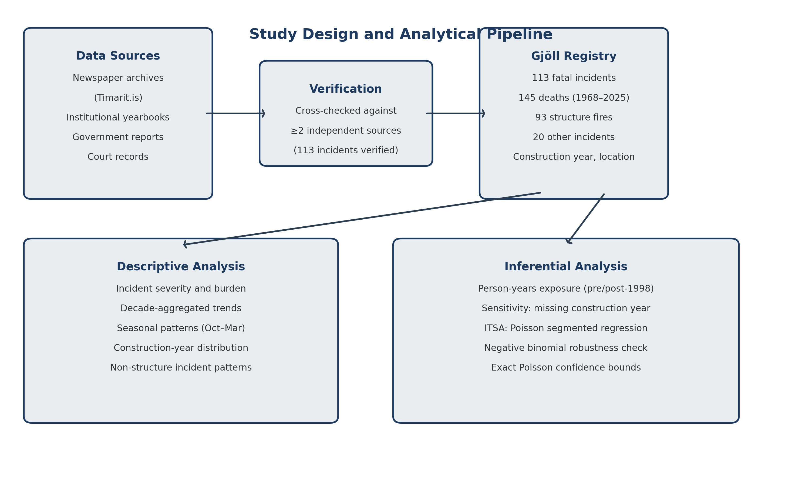

# Introduction {#sec-introduction}

Effective fire safety regulation depends upon reliable, long-term data to evaluate outcomes and direct prevention resources. However, national fire fatality statistics are often disseminated as aggregate counts without incident-level traceability, limiting their value for trend analysis and policy evaluation [@EFSA2018; @Holborn2003]. This is particularly true for small nations where annual counts are low and year-to-year variation is large. More broadly, evaluating whether a regulatory framework achieves its intended goals, what the governance literature terms institutional effectiveness [@Young2011], requires not only statistical trend data but also contextual understanding of how regulations translate into on-the-ground outcomes.

Despite a growing international literature on fire fatality trends, no country has published a complete national incident-level fatal fire dataset spanning multiple regulatory eras. Existing statistics are typically aggregate, lack traceability to individual incidents, and contain documented errors. In Iceland, for example, official records reported zero fire deaths in 2009 despite a confirmed fatal fire at Kljáströnd in Eyjafjörður that year. Without incident-level registries, evaluating whether specific regulatory milestones produce measurable safety gains remains limited to ecological inference from aggregate counts.

Iceland provides a uniquely informative case for studying the long-term effectiveness of fire safety regulation. Its small population (approximately 200,000 in 1968, growing to 388,000 in 2025) enables national-scale compilation of every fatal fire incident over nearly six decades, a level of completeness rarely achievable in larger jurisdictions. Iceland's centralized regulatory framework applies uniformly nationwide, providing clear before-and-after conditions for evaluating regulatory milestones. Iceland's building stock is among the youngest in Europe, with a mean construction year of approximately 1992 [@HMS2024buildingAge], meaning that a substantial and growing proportion of the housing stock already meets modern fire safety standards. This combination of complete incident data, identifiable regulatory interventions, and a young building stock creates conditions under which a central question can be examined with unusual clarity: does modern fire safety regulation eliminate fatal structure fires in new building stock?

The Gjöll^[In Norse mythology, Gjöll is the river that separates the world of the living from the world of the dead (Hel), crossed via the bridge Gjallarbrú (*Prose Edda*, Gylfaginning). The name is chosen for this registry to reflect its focus on fatal fire incidents.] Database on Fire and Fire Prevention (www.gjoll.is) was created to address the absence of such data. Covering 1968--2025, the registry constitutes the first national incident-level dataset for fatal fires in Iceland, compiled through systematic review of newspaper archives, institutional yearbooks, and official government reports, with source references for each record [@Smarason2025data; @Timarit]. This study uses the Gjöll registry to (i) describe long-term trends in fatal fire incidents and deaths, (ii) examine seasonal patterns, (iii) analyze the distribution of fatal structure fires by building construction year using cohort comparison and person-years exposure estimation, and (iv) test the 1999 regulatory intervention using interrupted time series analysis. This study frames long-run fire mortality trends as an outcome of institutional change, testing whether the transition to modern fire safety regulation produced measurable improvements in population-level safety. In doing so, it provides an empirical test of whether institutional change in fire safety regulation translates into measurable reductions in fatal fire risk.

# Regulatory Context {#sec-regulatory}

Iceland's fire safety framework has evolved through five principal legislative and regulatory milestones. The Fire Prevention Act (Lög nr. 55/1969) established the first national fire authority (Brunamálastofnun) and created the institutional basis for systematic fire prevention [@Iceland1969]. Subsequent fire prevention acts (Lög nr. 74/1982; Lög nr. 41/1992) progressively expanded regulatory duties and the scope of fire prevention oversight [@Iceland1982; @Iceland1992]. A revised building regulation (Byggingarreglugerð nr. 441/1998) introduced mandatory smoke detectors and approved portable fire extinguishers in all new dwelling units, marking the transition to modern prescriptive residential fire safety requirements [@Iceland1998]. The 1998--1999 transition represents a shift from a fragmented to a modern prescriptive fire safety regime. The current Fire Prevention Act (Lög nr. 75/2000) consolidated the legislative framework and established the statutory mandate that remains in force: "to protect the life and health of people, property and the environment by ensuring adequate fire prevention oversight, prevention measures, and preparedness" (art. 1) [@Iceland2000]. In 2010, the Mannvirkjalög (Lög nr. 160/2010) transferred institutional responsibility for building and fire safety oversight to Mannvirkjastofnun, subsequently reorganized as Húsnæðis- og mannvirkjastofnun (HMS).

The scale of the original challenge is illustrated by the 1968 fire prevention bill (Þingskjal 121), which noted that insurance payouts for fire damages during 1960--1967 equalled the cost of a major hydroelectric project, and that per-capita fire losses were two to three times higher than in the other Nordic countries [@Iceland1969; @Smarason2025practitioner]. The 1998 building regulation is the primary intervention tested in this study: it establishes the construction-year threshold (post-1998) used in the cohort comparison and serves as the breakpoint in the interrupted time series analysis.

# Data and Methods {#sec-methods}

## Data Sources and Registry Construction

The Gjöll registry was compiled through systematic review of newspaper archives (notably Tímarit.is), institutional yearbooks (Slökkvilið ríkisins, Brunamálastofnun), government investigation reports, and court records. All 113 fatal fire incidents were verified against at least two independent sources where available [@Smarason2025data; @Timarit]. The following subsections describe the data structure, classification logic, and analytical methods.

Two exported tables (CSV) from the Gjöll registry were analyzed: fatal structure fires (*n* = 93 incidents) and other fatal fire-related incidents (*n* = 20 incidents). The export metadata indicates a 2025-09-15 export date [@Smarason2025data]. The unit of analysis is the fatal incident. All fatal fire incidents in the export for 1968–2025 were included; no sampling was performed. We did not perform a formal validation against national cause-of-death registers and cannot quantify completeness of ascertainment. Under-ascertainment is plausible, particularly in earlier decades.

## Variables and Classification

Each incident record includes incident date, calendar year, and number of deaths. Structure-fire records additionally include municipality, address/postal code (when available), and building construction year (missing for 48 of 93 structure-fire incidents). Buildings are classified as "post-1998" if their recorded construction year is 1999 or later, corresponding to the effective year of Byggingarreglugerð nr. 441/1998 (see @sec-regulatory). All 48 missing construction-year cases predate 1996 and therefore cannot affect the post-1998 finding (see @sec-sensitivity). Other fatal fire-related incidents include a coarse subtype (e.g., ship fire or vehicle fire).

Incidents were classified into two categories: fatal fires in structures (93 incidents, 116 deaths) and other fire-related deaths involving ships, vehicles, and other non-building settings (20 incidents, 29 deaths). The classification criterion, applied uniformly regardless of building age or construction year, was whether the fire originated in or spread through the building structure such that structural fire safety features (egress, compartmentation, detection, suppression) were relevant to the fatality outcome.

Borderline cases required judgment. For example, a 2014 nursing home fire (building constructed 2001) where an elderly resident died was classified as "other" because the death resulted from a localized ignition (bedding) in a building whose fire safety systems functioned as designed; the fatality mechanism did not involve structural fire spread. Conversely, a criminal arson incident at Bræðraborgarstígur, Reykjavík, in 2020 (original construction year 1906, 3 deaths) was classified as a structure fire because fire spread through the building and structural safety features (egress routes, compartmentation) were material to the outcome [@HMS2020]. The same classification would have applied regardless of the building's construction year.

{#fig-pipeline}

## Statistical Analysis {#sec-analysis}

Descriptive summaries were computed for incident severity (deaths per incident), decade totals (incidents and deaths), seasonal patterns by calendar month and by heating season (October–March) versus non-heating season (April–September), and construction-year bands for fatal structure fires.

For population-adjusted rates, annual population on 1 January was obtained from Statistics Iceland (PX table MAN00000.px, Eining = 0) for 1968–2025 [@StatisticsIceland2025]. For each period bin, "mean population" is the mean of annual 1 January population counts across years in that bin. Crude annualized deaths per million population are reported by decade for Nordic comparability. To illustrate rare-event uncertainty for short observation windows, exact Poisson 95% confidence intervals are reported for selected rates.

**Person-years exposure approximation.** A direct comparison of fatality rates between pre-1998 and post-1998 buildings requires an estimate of the population at risk in each building cohort. No census-based housing-stock denominator stratified by construction period is available. To address this absence, we approximated person-years of exposure in pre-1998 versus post-1998 dwellings for the 1999–2025 period. Annual dwelling completions were modeled using stepped rates consistent with Iceland's construction history and the documented mean building-stock construction year of approximately 1992 [@HMS2024buildingAge; @HMS2025completions]. The assumed rates are 500/year prior to 1940, 2,000/year for 1940–1979, 2,500/year for 1980–1997, 3,000/year for 1998–2009, and 3,500/year for 2010–2025. Population was allocated to building-age strata proportionally to the modeled stock fraction. The constant completion-rate assumptions do not capture the substantial volatility in Iceland's construction industry. Statistics Iceland data (table IDN03001) show actual annual completions ranging from a peak of approximately 3,350 in 2007 to a trough of approximately 565 in 2011, a six-fold variation that the stepped model cannot represent. The stepped rates for 1998–2009 (3,000/year) and 2010–2025 (3,500/year) overestimate actual mean completions (approximately 1,900/year and 2,200/year, respectively). The modeled post-1998 person-years denominator is therefore likely overstated. This overstatement makes the analysis conservative: the true upper confidence bound for the post-1998 fatality rate would be higher than reported, though the qualitative conclusion (zero deaths, rate well below pre-1998) is unaffected. A sensitivity analysis halving or doubling the post-2010 completion rate changes the total post-1998 person-years by approximately ±30% but does not affect the zero numerator. These are order-of-magnitude approximations, not census-derived denominators, and should be validated against HMS dwelling registers when construction-year-stratified stock data become available.

**Sensitivity analysis for missing construction year.** Construction year is missing for 48 of 93 structure-fire incidents (52%). We examined the temporal distribution of incidents with missing construction year to assess whether missingness could affect the post-1998 finding.

**Interrupted time series analysis (ITSA).** To move beyond purely descriptive assessment, we fitted segmented regression models to annual fire death counts (structure and other combined) using generalized linear models with a Poisson distribution and log-link, with the natural logarithm of the annual population as an offset [@Wagner2002; @Bernal2017]. The primary model specified an intervention at 1999 (the effective year of Byggingarreglugerð nr. 441/1998, see @sec-regulatory):

$$\log(E[Y_t]) = \log(\text{pop}_t) + \beta_0 + \beta_1 \cdot \text{time} + \beta_2 \cdot \text{post1999} + \beta_3 \cdot \text{time} \times \text{post1999}$$

where $Y_t$ is annual fire deaths, $\text{pop}_t$ is the population offset, $\beta_1$ captures the secular trend, $\beta_2$ the level change at the intervention, and $\beta_3$ the slope change. Because building regulations affect fire mortality through gradual stock turnover rather than instantaneously, the level-change term should be interpreted as a convenient approximation of what is in reality a cumulative effect; the slope-change term partially captures this gradualism. A secondary model added an intervention at 1982 (Brunavarnalög nr. 74/1982). Overdispersion was assessed by the Pearson chi-squared dispersion ratio; a negative binomial model was fitted as a robustness check. Model comparison used Akaike's Information Criterion (AIC). Incidence rate ratios (IRR) with 95% confidence intervals are reported. Analyses were performed in Python 3 using statsmodels [@Seabold2010].

This study follows the STROBE guidelines for cross-sectional studies [@VonElm2007]; a completed checklist is provided as supplementary material.

## Practitioner and Policy Context

The lead author served as a firefighter and paramedic in Iceland for over a decade, subsequently held elected leadership of the national firefighter and paramedic union (Landssamband slökkviliðs- og sjúkraflutningamanna), and served at the institution responsible for national fire safety oversight (Húsnæðis- og mannvirkjastofnun). This progression, from operational response through practitioner advocacy to regulatory administration, informs the interpretation of statistical patterns in this study, particularly the distinction between regulatory intent and on-the-ground implementation that aggregate data alone cannot capture.

The analysis was further informed by the co-author's professional experience within the Arctic Council, which provided perspective on institutional dynamics and policy processes that are not fully recoverable from documentary sources alone. Together, these complementary perspectives (operational and governance) ensure that the interpretation of Iceland's regulatory trajectory accounts for both the formal frameworks recorded in legislation and the institutional realities that shape implementation.


# Results {#sec-results}

## Overall Burden and Incident Severity

Across 1968–2025 (58 calendar years), the export contains 113 fatal incidents resulting in 145 deaths (mean: 1.28 deaths per incident). Most incidents involve a single fatality (93/113, 82%) (@tbl-burden).

```{=latex}
\begin{table}[htbp]
\centering
\caption{Overall burden of fatal fire incidents in Iceland (1968--2025).}
\label{tbl-burden}
\begin{tabular}{@{}lrrr@{}}
\toprule
Category & Incidents (\textit{n}) & Deaths (\textit{n}) & Deaths/incident (mean) \\
\midrule
Structure fires           & 93  & 116 & 1.25 \\
Other fire-related deaths & 20  &  29 & 1.45 \\
\midrule
\textbf{Total}            & \textbf{113} & \textbf{145} & \textbf{1.28} \\
\bottomrule
\end{tabular}
\end{table}
```

## Long-Term Trends

Decade aggregation shows the highest burden in the 1970s (35 incidents, 47 deaths), followed by a sustained lower level from the 1990s onward (@tbl-periods; @fig-annual). Using Statistics Iceland denominators, crude annualized deaths per million population peak in the 1970s (21.9) and fall substantially to the range of 4–7 from the 1990s onward. Within the study period, eight calendar years record zero deaths (1984, 1987, 1992, 2000, 2003, 2007, 2011, 2015).

The apparent uptick in 2020–2025 reflects a six-year observation window and rare-event variability. An exact Poisson 95% confidence interval for the 2020–2025 crude annualized rate is approximately 3.8–11.1 deaths per million population per year, overlapping a corresponding interval for the 2010s (approximately 2.6–7.6). However, the period also coincides with repeated organizational restructuring of the responsible fire safety authorities (see @sec-discussion), raising the question of whether institutional capacity may have been affected. Whether the apparent uptick reflects stochastic variation, demographic change in at-risk populations, or reduced institutional capacity remains an open question that warrants continued monitoring.

```{=latex}
\begin{table}[htbp]
\centering
\caption{Period totals and crude mortality rates for fatal fire incidents in Iceland.}
\label{tbl-periods}
\begin{tabular}{@{}lrrS[table-format=6.0]S[table-format=2.1]@{}}
\toprule
Period & {Incidents (\textit{n})} & {Deaths (\textit{n})} & {Mean pop.\ (1\,Jan)} & {Deaths/million/yr} \\
\midrule
1968--1969\textsuperscript{a} &  6 & 13 & 201488 & 32.3 \\
1970--1979 & 35 & 47 & 214495 & 21.9 \\
1980--1989 & 19 & 24 & 238886 & 10.1 \\
1990--1999 & 13 & 14 & 264973 &  5.3 \\
2000--2009 & 14 & 17 & 296399 &  5.7 \\
2010--2019 & 14 & 15 & 325140 &  4.6 \\
2020--2025 & 12 & 15 & 370941 &  6.7 \\
\bottomrule
\end{tabular}

\smallskip
\footnotesize \textsuperscript{a}The 1968--1969 bin covers 2 years; the rate is unstable due to the short observation window.
Mean population is a crude denominator based on annual 1~January counts and does not account for changes in the age structure of the population, which may independently affect fire risk (e.g., an ageing population may increase the proportion of higher-risk elderly residents).
\end{table}
```

{#fig-annual}

## Building Age and Fatal Structure Fires

Construction year is recorded for 45 of 93 structure-fire incidents (48%). Missingness is concentrated in earlier decades; among structure-fire incidents from 1996 onward, construction year is complete (0 missing). Among incidents with known construction year, no observed fatal structure-fire incidents occurred in buildings constructed after 1998 (@tbl-construction; @fig-construction). In the 1996–2025 subset where construction year is complete, the mean construction year of buildings involved in fatal structure fires is 1957, whereas the mean construction year of the Icelandic building stock overall is 1992, according to data from the Housing and Construction Authority (Húsnæðis- og mannvirkjastofnun) [@HMS2024buildingAge].[^studlar]

[^studlar]: The fatal fire at Fossaleyni 17 (Stuðlar), Reykjavík (October 2024, 1 death) is recorded in the Gjöll registry with a construction year of 1996, consistent with the national property registry. However, an HMS investigation [@HMS2026Studlar] subsequently revealed that a 191 m² extension completed in 2004 had never received its safety and occupancy certificate (*öryggis- og lokaúttektarvottorð*) and was consequently never registered in the national property registry (*fasteignaskrá*). See @sec-discussion for analysis.

```{=latex}
\begin{table}[htbp]
\centering
\caption{Fatal structure fires by building construction year. The 1996--2025 subset is reported because construction year is complete from 1996 onward. In both datasets, zero fatal incidents occurred in buildings constructed after 1998.}
\label{tbl-construction}
\begin{tabular}{@{}l rr rr@{}}
\toprule
 & \multicolumn{2}{c}{Full dataset (\textit{n}\,=\,93)} & \multicolumn{2}{c}{1996--2025 subset (\textit{n}\,=\,35)} \\
\cmidrule(lr){2-3} \cmidrule(lr){4-5}
Construction year & Incidents & Deaths & Incidents & Deaths \\
\midrule
1900--1919 &  7 & 13 &  4 &  6 \\
1920--1939 &  3 &  3 &  1 &  1 \\
1940--1959 & 18 & 19 & 13 & 14 \\
1960--1979 & 11 & 12 & 11 & 12 \\
1980--1997 &  6 &  8 &  6 &  8 \\
Unknown    & 48 & 61 &  0 &  0 \\
\midrule
\textbf{Total} & \textbf{93} & \textbf{116} & \textbf{35} & \textbf{41} \\
\bottomrule
\end{tabular}
\end{table}
```

{#fig-construction}

## Seasonality

Fatal incidents occur year-round but concentrate in the heating season. October--March accounts for 66 of 113 fatal incidents (58%) and 84 of 145 deaths (58%) (@fig-seasonal). A chi-square goodness-of-fit test against a uniform monthly distribution yields $\chi^2 = 3.2$ (*df* = 1, *p* = 0.07) for incidents and $\chi^2 = 3.6$ (*df* = 1, *p* = 0.056) for deaths, a consistent directional pattern that falls short of conventional significance, reflecting the limited statistical power of 113 events.

{#fig-seasonal}

## Non-Structure Fatal Incidents

Non-structure incidents contribute 29 deaths across 20 incidents. Maritime incidents are prominent: ship fires account for 15 deaths across seven incidents, and vehicle fires account for three deaths across three incidents. The non-structure deaths are concentrated in the earlier decades of the study period (18 of 29 deaths occurred before 1990), suggesting that improvements in maritime and occupational fire safety may have contributed to the overall decline visible in @fig-annual alongside the residential improvements. The small number of events precludes formal trend analysis for this subgroup.

## Person-Years Exposure and Construction-Period Fatality Rates {#sec-personyears}

Using the modeled dwelling-stock approximation (@sec-analysis), the 1999–2025 period yields approximately 6.64 million person-years in pre-1998 dwellings and 2.08 million person-years in post-1998 dwellings. During this period, 38 structure-fire deaths occurred in pre-1998 buildings (among incidents with known construction year), yielding an approximate fatality rate of 0.57 per 100,000 person-years. Zero deaths occurred in post-1998 buildings during the study period (incidence rate: 0.00 per 100,000 person-years; rate ratio not estimable). The exact Poisson 95% upper confidence bound for the post-1998 rate is 0.14 per 100,000 person-years (one-sided), well below the pre-1998 rate. If the true rate in post-1998 buildings were equal to that in pre-1998 buildings, the expected number of deaths would be approximately 11.9, and the probability of observing zero events would be $7 \times 10^{-6}$, indicating that the zero observation is statistically informative, not merely a consequence of low exposure. Even if the true rate were one-tenth of the pre-1998 rate (0.057 per 100,000), the expected count would be 1.2, yielding a 30% probability of observing zero. The dwelling-stock model is approximate and may overestimate post-1998 exposure if second homes, vacancy, or demographic concentration in older stock are substantial; however, even halving the denominator raises the upper confidence bound only to 0.29 per 100,000, still below the pre-1998 rate.

## Sensitivity Analysis: Missing Construction Year {#sec-sensitivity}

All 48 incidents with missing construction year occurred between 1970 and 1995. Because a building that burned before 1999 cannot have been constructed after 1998, the missing data are logically irrelevant to the post-1998 finding: regardless of how missing values are imputed, the observed zero in post-1998 buildings is unaffected. The missingness is missing-not-at-random but in a direction that strengthens rather than undermines the key finding.

## Interrupted Time Series Analysis {#sec-itsa}

The Poisson ITSA model (AIC = 216.3; Pearson dispersion ratio = 1.15, indicating no major overdispersion) reveals a significant pre-1999 declining trend in fire mortality (IRR per year = 0.932, 95% CI 0.910–0.955, *p* < 0.001), a significant level decrease at the 1999 intervention (IRR = 0.106, 95% CI 0.019–0.586, *p* = 0.010), and a significant positive slope change post-1999 (IRR per year = 1.084, 95% CI 1.037–1.132, *p* < 0.001). The positive post-1999 slope change reflects a partial attenuation of the pre-1999 decline, not an increase in the absolute rate, which remains at historically low levels.

A negative binomial model fitted as a robustness check yielded similar point estimates (level-change IRR = 0.105) but substantially wider confidence intervals (95% CI 0.006–1.825, *p* = 0.12), reflecting the additional variance parameter. The Poisson model is preferred on parsimony grounds (dispersion ratio near 1.0, lower AIC: 216.3 vs 240.9), but the negative binomial result underscores that with only 145 deaths across 58 years, the level-change finding is sensitive to model specification. The pre-existing declining trend is robust across both models (*p* = 0.004 in the negative binomial).

Because building regulations affect mortality through gradual stock turnover rather than an instantaneous shift, the level-change term is a simplification; the significant slope-change term partially captures the gradualism of the regulatory effect. Accordingly, the estimated level change should be interpreted as a statistical approximation of a cumulative cohort effect rather than an instantaneous causal shift. A two-intervention model adding a 1982 breakpoint showed no improvement over the single-intervention model (ΔAIC = +3.4), suggesting that the 1999 regulation is the more parsimonious breakpoint for the observed mortality reduction. @fig-itsa presents the ITSA model fit with observed counts, fitted values, and the counterfactual trajectory.

![Interrupted time series analysis of annual fire-related deaths in Iceland (1968–2025). Upper panel: observed annual deaths with fitted values from the segmented regression model and counterfactual trajectory (no 1999 intervention). Lower panel: corresponding mortality rates per 100,000 population. Vertical lines indicate the 1982 fire prevention act and the 1999 building regulation. The displayed fit uses the negative binomial model; Poisson results are similar (see text). The level decrease at the 1999 intervention is significant under the Poisson model (IRR = 0.11, *p* = 0.010), though sensitive to distributional assumptions.](figures/fig4_itsa.png){#fig-itsa}

# Discussion {#sec-discussion}

## Summary of Key Findings

The central empirical pattern documented in this study is not merely a decline in aggregate fire mortality, but a structural separation between regulated and unregulated building cohorts. Post-1998 buildings, constructed to modern prescriptive fire safety standards, have recorded zero fatalities across approximately 2.08 million person-years of modeled exposure. The Gjöll registry documents an 80% decline in fire mortality rates from the 1970s (21.9 deaths per million) to the 2010s (4.6 per million), a consistent heating-season concentration (58% of incidents and deaths in October--March), and interrupted time series evidence of a structural break at the 1999 regulatory intervention. By the measure applied in governance research, whether a regime produces measurable progress toward its stated goals [@Young2011], Iceland's fire safety framework shows evidence of institutional effectiveness.[^hjardarhagi]

[^hjardarhagi]: A fatal residential fire at Hjarðarhagi, Reykjavík (May 2025, 2 deaths) is included in the registry with a construction year of 1967, consistent with the post-1998 finding. This incident is under criminal investigation for suspected arson.

## Mechanisms: Why Regulation Appears to Work

The post-1998 finding aligns with the intent of the 1998 building regulation, which mandates specific fire safety provisions in all new dwelling units [@Iceland1998]. Four mechanisms plausibly contribute to the observed safety gains:

1. **Detection**: mandatory smoke detectors in all new dwellings enable early warning, the single intervention most consistently associated with reduced fire fatality risk internationally [@Ahrens2021; @Gilbert2021].
2. **Suppression**: mandatory portable fire extinguishers provide occupants with immediate first-response capability.
3. **Compartmentation**: modern building code requirements for fire-rated walls, doors, and structural elements limit fire spread between rooms and units.
4. **Construction standards**: updated materials with improved fire resistance and modern electrical systems reduce ignition and spread risk.

In this sense, buildings effectively embody regulatory regimes: once constructed, they preserve the fire safety standards of their era, allowing institutional change to be observed through cohort comparisons of the existing stock.

The cumulative legislative trajectory (see @sec-regulatory) provided the institutional framework within which these provisions were implemented. The ITSA confirms a significant pre-existing declining trend (IRR = 0.93/year, *p* < 0.001), indicating that improvements predated the 1998 regulation, and a level decrease at the 1999 intervention (IRR = 0.11, *p* = 0.010 Poisson), consistent with an accelerated effect. Iceland's favourable Nordic comparison, approximately 5.5 deaths per million versus 8.8 (Norway), 10.1 (Sweden), 11.6 (Denmark), and 12.6 (Finland) for 2010--2019 [@MSB2023; @Smarason2025practitioner], is unlikely to be explained by building-stock age alone: Statistics Norway data indicate a mean building age broadly comparable to Iceland's, yet Norway records substantially higher mortality [@SSB2024]. This suggests that Iceland's outcomes reflect the combined effect of regulatory design, enforcement, fire service response, and public education.

## Alternative Explanations and Confounders

The post-1998 finding should not be attributed solely to the 1998 regulation. Several alternative explanations and confounders apply:

**Building-age survivorship bias.** Post-1998 buildings have had less time to accumulate age-related risk factors (electrical degradation, combustible material, undocumented modifications). The comparison is not age-standardized. The person-years approximation (@sec-personyears) addresses the exposure concern quantitatively, with an exact Poisson upper 95% confidence bound of 0.14 per 100,000, well below the pre-1998 rate of 0.57, but cannot fully resolve the age gradient.

**Socioeconomic selection.** Occupants of newer housing differ systematically from those in older stock. Older housing disproportionately houses lower-income populations, rental tenants, immigrants, and individuals with higher baseline fire risk [@Holborn2003; @Marshall1998; @Doyle2019]. The Bræðraborgarstígur case (arson in a 1906 building occupied by vulnerable individuals) illustrates this concentration.

**Concurrent improvements.** The 1990s saw secular declines in smoking prevalence, improved fire service response, and advances in emergency medical care, all of which reduce fire mortality independently of building codes [@Cunningham2018].

**Ecological fallacy.** Aggregate associations between building construction period and fatality counts do not establish individual-level causal effects [@Loney2014]. Smoke alarm operability, a stronger predictor of survival than building age [@Gilbert2021], cannot be inferred from construction-year data.

**ITSA counterfactual limitations.** The pre-1999 declining trend extrapolates toward zero regardless of intervention. The estimated level change may partly reflect a floor effect rather than a discrete regulatory impact. The negative binomial robustness check (*p* = 0.12) underscores that the level-change finding is sensitive to model specification.

The structural concentration of fatalities in older buildings, combined with zero events across more than 2 million post-1998 person-years, makes coincidence an insufficient explanation. The post-1998 finding is best interpreted as consistent with, but not proof of, the effectiveness of modern prescriptive fire safety requirements, and merits further investigation using individual-level data.

## Institutional Sustainability and Emerging Risks

The statistical gains documented in this study were achieved during a period of active institutional development. Whether those gains can be sustained depends on the maintenance of institutional capacity. Young [-@Young2011] emphasizes that regime effectiveness is dynamic: institutional arrangements that produce results in one period may lose efficacy if supporting conditions erode.

**Institutional transfers and capacity erosion.** The fire safety portfolio has undergone repeated transfers, from Brunamálastofnun (established 1969) to Mannvirkjastofnun and subsequently to Húsnæðis- og mannvirkjastofnun (HMS), resulting in fragmented record-keeping, diminished institutional memory, and no systematic database linking fire incidents to building characteristics. Government action plans have repeatedly proposed improvements without confirmed funding: a 2021 plan listed 23 emergency services measures, of which 15 required capital investment, yet none identified a funding source [@Heilbrigdisraduneytid2021]. The gap between stated policy objectives and resourced implementation remains substantial [@Althingires2019]. In 2020, the relocation of the fire prevention division from Reykjavík to Sauðárkrókur prompted complete staff turnover, confirming practitioner warnings of capacity loss [@RUV2020brunavarnir].

**The Stuðlar investigation.** The fatal fire at Fossaleyni 17 (October 2024, 1 death) provides the most concrete documented example of institutional weakness producing fatal consequences. The HMS investigation [@HMS2026Studlar] found that the Capital Region Fire and Rescue Service (SHS) ceased physical site inspections from 2022 onward, replacing them with paper-based self-reports from the building owner, despite outstanding violations never remedied. A 191 m² building extension completed in 2004 had operated without legal authorization for 20 years, undetected by inspection, unregistered in the national property registry, and absent from fire insurance records. Fire compartment doors were not closed, electronic escape routes failed, smoke vents did not open, and the evacuation plan was not followed. HMS concluded the fatality could have been prevented had prescribed measures been operational. This case illustrates the distinction between regulatory outputs (legislation enacted, standards adopted) and regulatory outcomes (lives protected).

**Unauthorized residential use and arson.** Recent fatalities at Funahöfði and Stangarhyl (both 2023) involved buildings designed for commercial use but occupied as dwellings, lacking residential fire safety provisions. Three confirmed or suspected arson incidents account for seven deaths: Kirkjuvegur, Selfoss (2018, 2 deaths) [@Haestirettur2020Selfoss]; Bræðraborgarstígur, Reykjavík (2020, 3 deaths, 1906 building) [@HMS2020; @Landsrettur2022Braedraborgarstigur]; Hjarðarhagi, Reykjavík (2025, 2 deaths). All occurred in older buildings involving interpersonal conflict or housing precarity among vulnerable populations, a combination that prescriptive codes alone cannot address.

**Data quality as institutional indicator.** The Gjöll registry was compiled because existing official statistics lacked incident-level traceability and contained documented errors (e.g., 2009 recorded as zero fire deaths despite a confirmed fatality at Kljáströnd) [@Smarason2025practitioner]. The registry approach, with source references for each incident, supports auditable trend analysis and reproducible research [@Smarason2025data].

All three patterns, institutional erosion, unauthorized use, and arson, disproportionately affect vulnerable populations. The benefits of fire safety progress accrue primarily to compliant housing; those with the fewest resources face the greatest residual risk [@Smarason2025practitioner]. Effective fire safety requires not only regulatory standards but also active enforcement, inspection of existing stock, and interagency coordination.

## External Validity

Iceland's small population, centralized governance, and young building stock limit direct generalization of specific rates to larger or more heterogeneous jurisdictions. However, the methodological approach, a complete national incident-level registry linked to building characteristics and regulatory milestones, is transferable. The finding that a clear construction-year threshold separates regulated from unregulated building cohorts is relevant to Nordic and other high-income countries with comparable prescriptive fire safety frameworks. The concentration of fatalities in October--March is consistent with established seasonal patterns across Northern Europe, attributed to heating demand, extended indoor exposure, and reduced nighttime escape margins [@EFSA2018], and may be particularly pronounced in the Nordic context due to sustained winter heating and extended polar darkness.

## Implications for Policy and Practice

Four practical directions follow from these findings:

1. **Targeted retrofit and inspection of older housing stock.** The concentration of fatalities in pre-1998 buildings supports prioritizing smoke detector installation, egress improvement, and systematic inspection in older dwellings.

2. **Heating-season prevention campaigns.** The October--March concentration supports targeted seasonal campaigns addressing heating safety, smoke alarm maintenance, and escape planning.

3. **Enforcement capacity as prerequisite.** The Stuðlar investigation demonstrates that regulation without sustained enforcement is insufficient. Building code compliance at the design stage must be matched by operational compliance and active inspection, particularly in facilities housing non-self-evacuating populations.

4. **Retrofit incentives.** The combination of fatality concentration in pre-1998 buildings and Iceland's relatively young building stock (mean construction year approximately 1992) suggests that the fire fatality problem is within reach of substantial further reduction. Targeted policy instruments, such as tax incentives, subsidized smoke detector installation, or conditional grants for fire safety upgrades in older dwellings, merit evaluation as complements to prescriptive standards for new construction.

Future research should pursue individual-level data linking building characteristics, occupant demographics, and fire safety equipment status to enable causal inference beyond the aggregate associations documented here. Insurance claims data represent an additional avenue for assessing the economic dimension of fire safety regulation effectiveness. The demographic composition of populations vulnerable to fire fatality, including the growing proportion of foreign-born residents in older housing stock, warrants systematic investigation.

# Limitations {#sec-limitations}

This study is descriptive and subject to several limitations.

First, **small sample size and rare-event instability**: 145 deaths across 58 years constitutes a small dataset by epidemiological standards. Decade-level estimates are sensitive to individual high-casualty incidents; for example, the Bræðraborgarstígur arson in 2020 (3 deaths) accounts for 20% of the 2020--2025 death total. Readers should interpret decade-level comparisons as indicative trends rather than precise estimates.

Second, the registry includes only fatal incidents; trends in non-fatal fire incidence and property damage cannot be assessed, limiting evaluation of whether regulation reduces fire *occurrence* versus fire *lethality*.

Third, completeness of ascertainment cannot be quantified; under-ascertainment is plausible, particularly in earlier decades when archival sources may be incomplete.

Fourth, **missing construction-year data**: construction year is missing for 48 of 93 structure-fire incidents (52%), concentrated entirely in pre-1996 incidents. The sensitivity analysis (@sec-sensitivity) demonstrates that all 48 incidents occurred between 1970 and 1995, making it logically impossible for any to represent post-1998 buildings.

Fifth, the post-1998 finding relies on a modeled housing-stock denominator rather than census-derived dwelling counts stratified by construction period (@sec-personyears). Until dwelling-stock data cross-tabulated by construction year become available, the separation of improved building design, reduced exposure time, and sociodemographic differences remains approximate.

Sixth, **building-age survivorship bias**: the comparison between pre- and post-1998 buildings is not age-standardized. A building constructed in 1997 has had 28 years to accumulate risk factors, whereas a 2020 building has had only 5.

Seventh, **temporal confounding**: the decline in fire mortality coincided with secular reductions in smoking prevalence, improvements in emergency medical services, and changes in household composition and heating technology. The ITSA cannot separate these concurrent trends from the effect of building regulation.

Eighth, key individual-level determinants (smoke alarm presence and operability, alcohol involvement, smoking, mobility limitations) are not captured as structured variables. Given that approximately 60% of U.S. home fire deaths occur in dwellings without working smoke alarms [@Ahrens2021] and that alarm operability is a stronger predictor of survival than building age [@Gilbert2021], this data gap is a substantial constraint on causal inference. Individual-level risk factors consistently identified in other jurisdictions (alcohol impairment, living alone, advanced age, impaired mobility) [@Holborn2003; @Marshall1998; @Doyle2019] cannot be assessed from the Gjöll registry.

Ninth, the study cannot assess the extent of voluntary retrofit activity (smoke detector installation, electrical upgrades) in pre-1998 buildings, limiting the ability to determine whether the construction-year threshold reflects regulatory requirements or broader safety improvements across the housing stock.

# Conclusions {#sec-conclusions}

The Gjöll fatal incident registry for 1968--2025 documents a structural separation between regulated and unregulated building cohorts in Iceland. Zero fatalities were observed in post-1998 dwellings across approximately 2.08 million person-years of modeled exposure (exact Poisson upper 95% confidence bound: 0.14 per 100,000), compared with 0.57 per 100,000 in pre-1998 dwellings. Interrupted time series analysis confirms a significant pre-existing declining trend and identifies a level decrease at the 1999 regulatory intervention (*p* = 0.010 Poisson, *p* = 0.12 negative binomial). The sensitivity of the level-change finding to model specification is the central statistical caveat; the post-1998 finding is consistent with, but cannot conclusively demonstrate, a discrete regulatory impact. Construction year is a proxy for multiple correlated changes, the comparison is not age-standardized, and temporal confounders cannot be separated from regulatory effects.

The practical significance of these findings extends beyond the statistical caveats. Three policy implications follow directly from the evidence:

1. **Retrofit programs for pre-1998 housing.** The remaining fatal fire burden is concentrated in older building stock (mean construction year 1957). Targeted retrofit programs, particularly smoke detector installation and egress improvement, represent the most direct intervention available. Fiscal instruments such as tax incentives, subsidized installations, or conditional grants merit evaluation.

2. **Sustained enforcement capacity.** The 2024 Stuðlar investigation [@HMS2026Studlar] demonstrates that regulation without enforcement is insufficient. The progression from active inspection to paper-based compliance to uninspected non-compliance produced a preventable fatality in a government-owned facility. Institutional continuity and adequately resourced inspection regimes are prerequisites for maintaining the safety gains documented here.

3. **Institutional continuity.** The gains documented in this study were achieved during a period of active institutional development. The pattern of repeated institutional transfers, unfunded action plans, and staff turnover raises questions about long-term sustainability that merit attention from policymakers.

The Gjöll registry is publicly deposited [@Smarason2025data] as updatable research infrastructure, not a one-time output. Future research should pursue individual-level data linking building characteristics, occupant demographics, and fire safety equipment status; insurance claims data for the economic dimension; and census-linked building-stock denominators for more precise exposure estimates. Continued evaluation of whether Iceland's fire safety regime remains effective not only on paper but in practice depends on maintaining the institutional capacity and data infrastructure that the evidence base requires.

# Acknowledgments {.unnumbered}

The authors acknowledge the use of Claude Code (Anthropic) for assistance with Python script development for statistical analysis. All code, model specifications, and outputs were independently verified by the lead author.

# Funding {.unnumbered}

This research received no specific grant from any funding agency in the public, commercial, or not-for-profit sectors.

# Declarations {.unnumbered}

**Conflict of Interest:** The authors declare no competing interests.

**Ethics:** The analyzed export contains no direct personal identifiers. Address-level fields are present for some incidents as part of the historical record but were not analyzed at the individual-household level.

**Data Availability:** The analyzed data tables are deposited at GAGNÍS – Gagnaþjónusta félagsvísinda (DOI: 10.34881/I5WGJU) and are also available through the public Gjöll interface at <https://www.gjoll.is>. Reproducibility scripts (Python) and generated outputs for all statistical models (including ITSA) are openly available on GitHub at <https://github.com/Magnussmari/gjoll-fire-technology> and archived in the accompanying data repository [@Smarason2025data].

# References {.unnumbered}

::: {#refs}
:::
